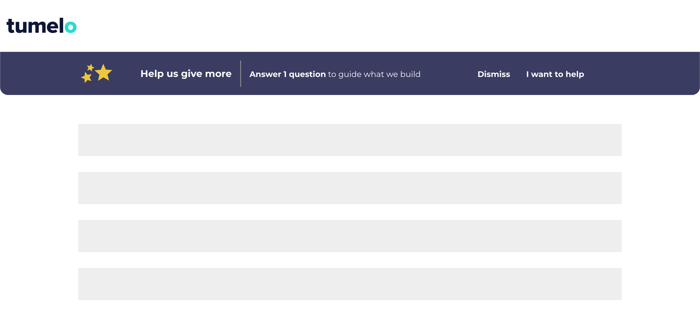

# Banner Component

This banner was created for Tumelo using `create-react-app`.

As this is a technical test, I've kept the CSS strictly to `styled-components` and raw `flexbox` rather than any CSS framework, so that you can hopefully see I understand the underpinning technologies we talked about in the interview.

## How To Improve

I wanted to match my design as closely as possible to the brief so you get a good idea of my technical skill, but if this was real life there would be a few improvements I'd suggest - so I thought I'd jot them down here:

- **More Emphasis on CTA:** I'd change the "I want to help" button into an actual button, to differentiate it from the other "Dismiss" button, and help guide the user to what we want them to do. For the same reason, I might change the Dismiss to a light grey to entice the user not to click "Dismiss".

- **Include Question & an input box:** If there really was only one question, I'd think about designing the notification in such a way that it actually _asks_ the question and allows the user to submit feedback within the notification. That way you cut out a stage in the user journey.

## Getting Started

In the project directory, once you've installed all dependencies with `yarn install`, you can run:

### `yarn start`

Runs the app in the development mode.

The **Frontend React App** will be running on:
[localhost:3000](http://localhost:3000/ "http://localhost:3000/")

The page will reload if you make edits.
You will also see any lint errors in the console.

## Author

#### **Alexander Jack Hughes**

[@alexjackhughes](https://twitter.com/alexjackhughes "Twitter")
